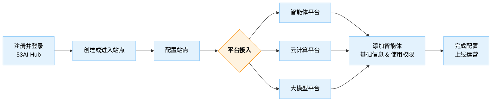

## 云服务

> 注意：53AI Hub 当前处于 Beta 测试阶段，如文档与实际产品存在差异，请以产品为准。

53AI Hub云服务是一个面向非技术用户的智能体发布和运营平台，无需技术背景即可快速构建自己独立的AI门户。

### 产品能力

- **接入智能体开发平台**：接入字节扣子、腾讯元器、Dify、FastGPT 、RAGFlow、53AI Studio等主流的智能体开发平台。
- **智能体统一发布与运营**：跨智能体开发平台的统一发布和运营，支持灵活的用户订阅与使用权限。
- **用户管理与订单管理**：管理员可查看用户、订阅、订单等关键数据。
- **用户权限与积分体系**：支持设定用户权限及订阅费用、积分设定。
- **自定义与扩展能力**：支持自定义站点风格与专属域名，实现独立品牌运营。

### 开始使用

任何人都在线申请开通 53AI Hub 的云服务。

以下是使用步骤：

1. **注册并登录** https://hub.53ai.com ；
2. **创建或进入站点**：
   - 首次使用点击「创建站点」
   - 非首次则选择已有站点
3. **配置站点**：上传 Logo、填写站点名称、站点简介等基本内容；
4. **平台接入**：
   - 智能体平台（如扣子、Dify 等）→ 需提前在智能体开发平台中构建好智能体；
   - 云计算平台（如火山方舟、阿里百炼）；
   - 大模型平台（如 OpenAI、硅基流动、深度求索）；
5. **添加智能体**：填写发布智能体的基础信息，配置调用权限；
6. **完成配置并上线运营**！

> 注：53AI Hub支持同时接入多个智能体平台、对智能体进行聚合发布与运营。

### 版本差异

平台提供灵活的订阅机制，满足不同用户与不同阶段的运营需求，你也可从 [免费版本](http://hub.53ai.com) 开始体验。

| 云服务版本     | 免费版 | 标准版            | 企业版            |
| -------------- | ------ | ----------------- | ----------------- |
| **运营能力**   |        |                   |                   |
| 智能体         | 5个    | 不限              | 不限              |
| 支付配置       | ❌     | 微信支付/手工转账 | 微信支付/手工转账 |
| 注册用户       | 100个  | 不限              | 不限              |
| 内部用户       | ❌     | ❌                | 部门/成员/分组    |
| **集成能力**   |        |                   |                   |
| 智能体平台接入 | ✅     | ✅                | ✅                |
| 云计算平台接入 | ✅     | ✅                | ✅                |
| 大模型平台接入 | ✅     | ✅                | ✅                |
| 图片视觉       | ✅     | ✅                | ✅                |
| 文档解析       | ✅     | ✅                | ✅                |
| 开放搜索       | ✅     | ✅                | ✅                |
| **个性化**     |        |                   |                   |
| 自定义二级域名 | ✅     | ✅                | ✅                |
| 独立域名绑定   | ❌     | ✅                | ✅                |
| 自定义界面     | ✅     | ✅                | ✅                |
| 去除版权       | ❌     | ❌                | ✅                |
| 私有化部署     | ✅     | ✅                | ✅                |
| **服务支持**   |        |                   |                   |
| 社群讨论群     | ✅     | ✅                | ✅                |
| 1V1支持群      | ❌     | ✅                | ✅                |
| 培训服务       | ❌     | ❌                | ✅                |
| **价格**       | 免费   | 5880元/年         | 12800元/年        |

### 常见问题

**1. 可以接入多个智能体开发平台吗？**

可以。53AI Hub支持同时接入多个智能体开发平台（如扣子、Dify、FastGPT 等），你可以跟进自己的需求将不同开发平台开发的智能体进行统一发布和运营。

但请注意，目前扣子平台仅支持接入单个开发者账号，即同一站点下暂时不能同时接入不同开发者账号下的扣子智能体。

**2. 没有智能体开发平台能使用吗？**

是的。你必须已经在智能体开发平台上已经开发好了智能体，并通过对应平台的 API 接入到 53AI Hub。请根据平台指引或产品文档完成智能体开发平台的接入。

**3. 在哪里开发和编排智能体？**

53AI Hub 产品定位是智能体发布与运营平台，不支持智能体的开发和编排。你需要在平台支持的智能体开发平台（如：扣子、Dify 等）上完成智能体的开发、编排。完成智能体的开发和编排后才能将并其接入至53AI Hub进行发布和运营。

**4. 为什么我的扣子智能体接入失败？**

自查在接入扣子平台的第二步，在扣子平台的 OAuth 应用授权中填写了你的 53AI Hub站点的“重定向 URL”？

**5. 扣子平台显示接入成功了，但添加智能体时显示没有可选的智能体？**

请自查以下情况是否满足：

- 扣子智能体平台中是否成功创建了智能体并发布？
- 扣子智能体发布时是否勾选了 “API” 和 “Chat SDK” 权限？

**6. 已经添加成功的智能体为什么站点上看不到？**

请检查以下两点：

- 「应用管理 - 智能体」中该智能体是否已启用？
- 用户所在的订阅组是否有该智能体的使用权限？
