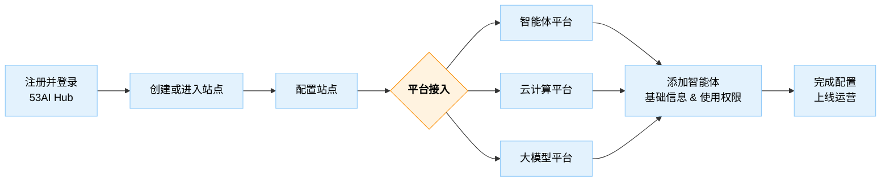

## 1. 什么是 53AI Hub云服务？

> 注意：53AI Hub 当前处于 Beta 测试阶段，如文档与实际产品存在差异，请以产品为准。

53AI Hub云服务是一个面向非技术用户的智能体发布和运营平台，无需技术背景即可快速构建自己独立的AI门户。

## 2. 53AI Hub云服务有哪些能力？

- **接入智能体开发平台**：接入字节扣子、腾讯元器、Dify、FastGPT 、RAGFlow、53AI Studio等主流的智能体开发平台。
- **智能体统一发布与运营**：跨智能体开发平台的统一发布和运营，支持灵活的用户订阅与使用权限。
- **用户管理与订单管理**：管理员可查看用户、订阅、订单等关键数据。
- **用户权限与积分体系**：支持设定用户权限及订阅费用、积分设定。
- **自定义与扩展能力**：支持自定义站点风格与专属域名，实现独立品牌运营。

## 3. 如何开始使用53AI Hub云服务？

任何人都在线申请开通 53AI Hub 的云服务。平台提供灵活的 [套餐与价格](https://hub.53ai.com/pricing)，满足不同用户与不同阶段的运营需求，你也可从 [免费版本](http://hub.53ai.com) 开始体验（支持 10 个应用、每月 1000 次调用）。

以下是使用步骤：

1. **注册并登录** https://hub.53ai.com ；
2. **创建或进入站点**：
   - 首次使用点击「创建站点」
   - 非首次则选择已有站点
3. **配置站点**：上传 Logo、填写站点名称、站点简介等基本内容；
4. **平台接入**：
   - 智能体平台（如扣子、Dify 等）→ 需提前在智能体开发平台中构建好智能体；
   - 云计算平台（如火山方舟、阿里百炼）；
   - 大模型平台（如 OpenAI、硅基流动、深度求索）；
5. **添加智能体**：填写发布智能体的基础信息，配置调用权限；
6. **完成配置并上线运营**！

> 注：53AI Hub支持同时接入多个智能体平台、对智能体进行聚合发布与运营。

## 版本差异

<table>
 <colgroup>
    <col style="width: 20%;">
    <col style="width: 20%;">
    <col style="width: 20%;">
    <col style="width: 20%;">
  </colgroup>

<tr>
    <th>云服务版本</th>
    <th>免费版</th>
    <th>标准版</th>
    <th>企业版</th>
  </tr>

<tr>
  <th>运营能力</th>
  <th colspan="3"></th>
</tr>

<tr>
  <td align="center">智能体数量</td>
  <td align="center">5</td>
  <td align="center">不限</td>
  <td align="center">不限</td>
</tr>

<tr>
  <td align="center">支付配置</td>
  <td align="center">❌</td>
  <td align="center">✅</td>
  <td align="center">✅</td>
</tr>

<tr>
  <td align="center">外部用户</td>
  <td align="center">100</td>
  <td align="center">不限</td>
  <td align="center">不限</td>
</tr>

<tr>
  <td align="center">内部用户</td>
  <td align="center">❌</td>
  <td align="center">❌</td>
  <td align="center">✅</td>
</tr>

<tr>
 <th>集成能力</th>
 <th colspan="3"></th>
</tr>

<tr>
  <td align="center">扣子接入</td>
  <td align="center">✅</td>
  <td align="center">✅</td>
  <td align="center">✅</td>
</tr>

<tr>
  <td align="center">DIFY接入</td>
  <td align="center">✅</td>
  <td align="center">✅</td>
  <td align="center">✅</td>
</tr>

<tr>
  <td align="center">FastGPT接入</td>
  <td align="center">✅</td>
  <td align="center">✅</td>
  <td align="center">✅</td>
</tr>

<tr>
  <td align="center">53AI Studio接入</td>
  <td align="center">✅</td>
  <td align="center">✅</td>
  <td align="center">✅</td>
</tr>

<tr>
  <td align="center">自定义模型接入</td>
  <td align="center">❌</td>
  <td align="center">✅</td>
  <td align="center">✅</td>
</tr>

<tr>
  <td align="center">开放搜索</td>
  <td align="center">❌</td>
  <td align="center">✅</td>
  <td align="center">✅</td>
</tr>

<tr>
  <th>个性化</th>
  <th colspan="3"></th>
</tr>

<tr>
  <td align="center">自定义二级域名</td>
  <td align="center">✅</td>
  <td align="center">✅</td>
  <td align="center">✅</td>
</tr>

<tr>
  <td align="center">独立域名绑定</td>
  <td align="center">❌</td>
  <td align="center">✅</td>
  <td align="center">✅</td>
</tr>

<tr>
  <td align="center">自定义界面</td>
  <td align="center">❌</td>
  <td align="center">✅</td>
  <td align="center">✅</td>
</tr>

<tr>
  <td align="center">去除版权</td>
  <td align="center">❌</td>
  <td align="center">❌</td>
  <td align="center">✅</td>
</tr>

<tr>
  <td align="center">私有化部署</td>
  <td align="center">❌</td>
  <td align="center">❌</td>
  <td align="center" >✅</td>
</tr>

<tr>
  <th>服务支持</th>
  <th colspan="3"></th>
</tr>

<tr>
  <td align="center">社群讨论群</td>
  <td align="center">✅</td>
  <td align="center">✅</td>
  <td align="center">✅</td>
</tr>

<tr>
  <td align="center">1V1支持群</td>
  <td align="center">❌</td>
  <td align="center">✅</td>
  <td align="center">✅</td>
</tr>

<tr>
  <td align="center">培训服务</td>
  <td align="center">❌</td>
  <td align="center">✅</td>
  <td align="center">✅</td>
</tr>
</table>

