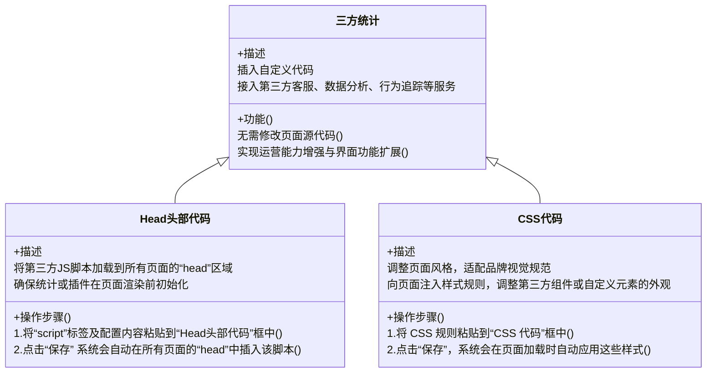
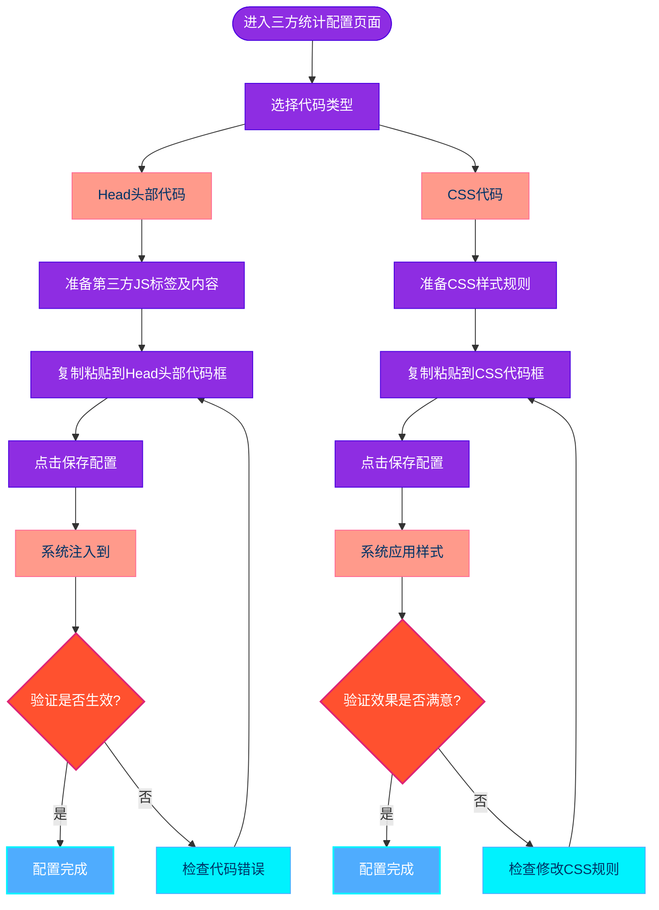

# 表达方式1

```mermaid
classDiagram
direction TB

class 三方统计 {
    +描述
    插入自定义代码
    接入第三方客服、数据分析、行为追踪等服务
    +功能()
    无需修改页面源代码()
    实现运营能力增强与界面功能扩展()
}

class Head头部代码 {
    +描述
    将第三方JS脚本加载到所有页面的“head”区域
    确保统计或插件在页面渲染前初始化
    +操作步骤()
    1.将“script”标签及配置内容粘贴到“Head头部代码”框中()
    2.点击“保存” 系统会自动在所有页面的“head”中插入该脚本()
}

class CSS代码 {
    +描述
    调整页面风格，适配品牌视觉规范
    向页面注入样式规则，调整第三方组件或自定义元素的外观
    +操作步骤()
    1.将 CSS 规则粘贴到“CSS 代码”框中()
    2.点击“保存”，系统会在页面加载时自动应用这些样式()
}

三方统计 <|-- Head头部代码
三方统计 <|-- CSS代码
```

# 表达方式2

```mermaid
flowchart TD
    A([进入三方统计配置页面]) --> B["选择代码类型"]
    B --> C1["Head头部代码"] & C2["CSS代码"]
    
    %% Head头部代码流程
    C1 --> D1["准备第三方JS标签及内容"]
    D1 --> E1["复制粘贴到Head头部代码框"]
    E1 --> F1["点击保存配置"]
    F1 --> G1["系统注入到<head>"]
    G1 --> H1{"验证是否生效?"}
    H1 -->|是| I1["配置完成"]
    H1 -->|否| J1["检查代码错误"]
    J1 --> E1
    
    %% CSS代码流程
    C2 --> D2["准备CSS样式规则"]
    D2 --> E2["复制粘贴到CSS代码框"]
    E2 --> F2["点击保存配置"]
    F2 --> G2["系统应用样式"]
    G2 --> H2{"验证效果是否满意?"}
    H2 -->|是| I2["配置完成"]
    H2 -->|否| J2["检查修改CSS规则"]
    J2 --> E2
    
    %% 样式定义
    classDef startEnd fill:#43E97B,stroke:#38F9D7,stroke-width:2px,color:#003366
    classDef normalStep fill:#8E2DE2,stroke:#4A00E0,stroke-width:1px,color:white
    classDef decisionStep fill:#FF512F,stroke:#DD2476,stroke-width:2px,color:white
    classDef actionStep fill:#00F2FE,stroke:#4FACFE,stroke-width:1px,color:#003366
    classDef configStep fill:#FF9A8B,stroke:#FF6B95,stroke-width:1px,color:#003366
    classDef finishStep fill:#4facfe,stroke:#00f2fe,stroke-width:2px,color:white
    
    %% 应用样式
    class Start startEnd
    class A,B,D1,D2,E1,E2,F1,F2 normalStep
    class H1,H2 decisionStep
    class J1,J2 actionStep
    class C1,C2,G1,G2 configStep
    class I1,I2 finishStep
```

