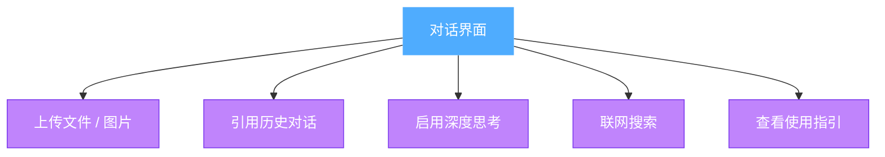
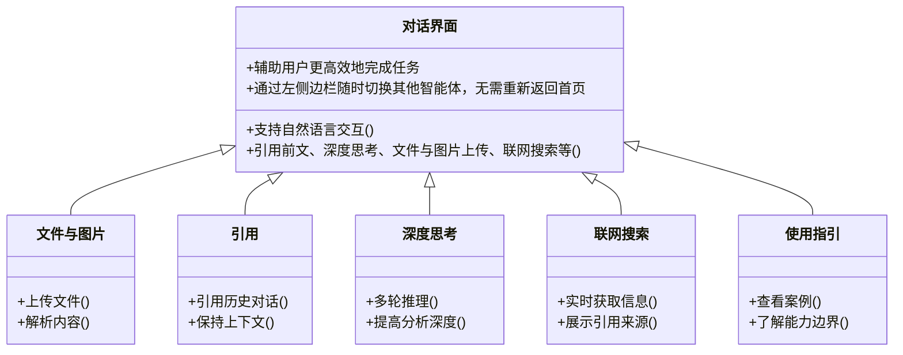

```mermaid
flowchart TD
    Center["对话界面"] --> F1["上传文件 / 图片"] & F2["引用历史对话"] & F3["启用深度思考"] & F4["联网搜索"] & F5["查看使用指引"]

     Center:::center
     F1:::func
     F2:::func
     F3:::func
     F4:::func
     F5:::func
    classDef center fill:#4FACFE,stroke:#38F9D7,stroke-width:1px,color:white
    classDef func fill:#C084FC,stroke:#7C3AED,stroke-width:1px,color:white
    style Center stroke:none
```

```mermaid
classDiagram
direction TB

    对话界面 <|-- 文件与图片
    对话界面 <|-- 引用
    对话界面 <|-- 深度思考
    对话界面 <|-- 联网搜索
    对话界面 <|-- 使用指引

    对话界面 : +辅助用户更高效地完成任务
    对话界面 : +通过左侧边栏随时切换其他智能体，无需重新返回首页
    对话界面 : +支持自然语言交互()
    对话界面 : +引用前文、深度思考、文件与图片上传、联网搜索等()

    文件与图片 : +上传文件()
    文件与图片 : +解析内容()

    引用 : +引用历史对话()
    引用 : +保持上下文()

    深度思考 : +多轮推理()
    深度思考 : +提高分析深度()

    联网搜索 : +实时获取信息()
    联网搜索 : +展示引用来源()

    使用指引 : +查看案例()
    使用指引 : +了解能力边界()
```

