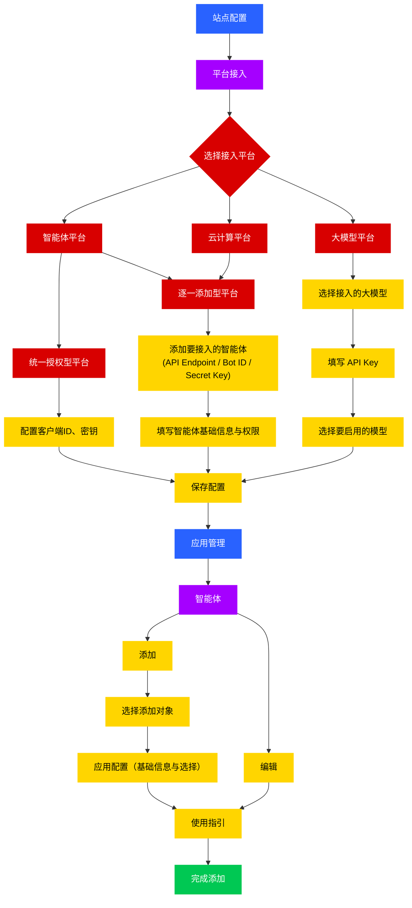

```mermaid
flowchart TD
    siteConfig["站点配置"] --> platformAccess["平台接入"]
    appManageEntry["应用管理"] --> agentEntry["智能体"]
    platformAccess --> platformSelect{"选择接入平台"}
    platformSelect --> agentPlatform["智能体平台"] & cloudPlatform["云计算平台"] & modelPlatform["大模型平台"]
    agentPlatform --> agentStepByStep["逐一添加型平台"] & agentUnified["统一授权型平台"]
    cloudPlatform --> agentStepByStep
    agentStepByStep --> smartAgentAdd["添加要接入的智能体<br>(API Endpoint / Bot ID / Secret Key)"]
    smartAgentAdd --> smartAgentBaseInfo["填写智能体基础信息与权限"]
    agentUnified --> unifiedConfig["配置客户端ID、密钥"]
    unifiedConfig --> save2["保存配置"]
    smartAgentBaseInfo --> save2
    modelPlatform --> modelChoose["选择接入的大模型"]
    modelChoose --> modelApiKey["填写 API Key"]
    modelApiKey --> modelSelect["选择要启用的模型"]
    modelSelect --> save2
    save2 --> appManageEntry
    agentEntry --> addBtn["添加"] & editBtn["编辑"]
    addBtn --> addTarget["选择添加对象"]
    addTarget --> addDetail["应用配置（基础信息与选择）"]
    addDetail --> addGuide["使用指引"]
    editBtn --> addGuide
    addGuide --> addComplete["完成添加"]

     siteConfig:::level1
     platformAccess:::level2
     appManageEntry:::level1
     agentEntry:::level2
     platformSelect:::decision
     agentPlatform:::decision
     cloudPlatform:::decision
     modelPlatform:::decision
     agentStepByStep:::decision
     agentUnified:::decision
     smartAgentAdd:::operation
     smartAgentBaseInfo:::operation
     unifiedConfig:::operation
     save2:::operation
     modelChoose:::operation
     modelApiKey:::operation
     modelSelect:::operation
     addBtn:::operation
     editBtn:::operation
     addTarget:::operation
     addDetail:::operation
     addGuide:::operation
     addComplete:::done
    classDef decision fill:#D80000, color:#fff, stroke-width:1px, stroke-dasharray: 0, stroke:#D50000
    classDef operation fill:#FFD500, color:#000, stroke:#FFD600
    classDef level2 fill:#A500FF, color:#fff, stroke:#AA00FF
    classDef level1 fill:#2962FF, color:#fff, stroke:#2962FF
    classDef done fill:#00C853, color:#fff, stroke:#00C853
```

