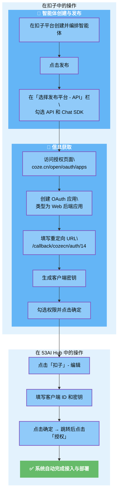
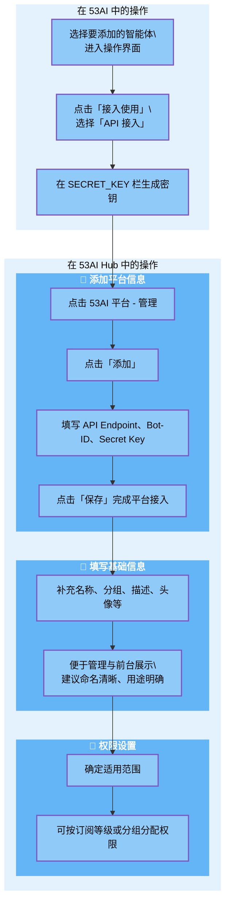

# 统一部署型

扣子为例

```mermaid
flowchart TD
  subgraph A[在扣子中的操作]
    subgraph A1[📘 智能体创建与发布]
      A1_1[在扣子平台创建并编排智能体]
      A1_2[点击发布]
      A1_3[在「选择发布平台 - API」栏\\n勾选 API 和 Chat SDK]
    end

    subgraph A2[📘 信息获取]
      A2_1[访问授权页面\\ncoze.cn/open/oauth/apps]
      A2_2[创建 OAuth 应用\\n类型为 Web 后端应用]
      A2_3[填写重定向 URL\\n/callback/cozecn/auth/14]
      A2_4[生成客户端密钥]
      A2_5[勾选权限并点击确定]
    end
  end

  subgraph B[在 53AI Hub 中的操作]
    B1[点击「扣子」- 编辑]
    B2[填写客户端 ID 和密钥]
    B3[点击确定 → 跳转后点击「授权」]
    B4[✅ 系统自动完成接入与部署]
  end

  A1_1 --> A1_2 --> A1_3 --> A2_1
  A2_1 --> A2_2 --> A2_3 --> A2_4 --> A2_5 --> B1
  B1 --> B2 --> B3 --> B4

  %% 样式定义
  classDef mainGroup fill:#E3F2FD,color:#000,stroke:#E3F2FD
  classDef subPhase fill:#64B5F6,color:#fff,stroke:#64B5F6,font-weight:bold
  classDef subPhaseBold fill:#64B5F6,color:#fff,stroke:#64B5F6,stroke-width:2px,font-weight:bold
  classDef stepNode fill:#90CAF9,color:#000,stroke:#7E57C2,stroke-width:2px
  classDef finalNode fill:#66BB6A,color:#fff,font-weight:bold,stroke:#66BB6A

  %% 应用样式
  class A,B mainGroup
  class A1 subPhaseBold
  class A2 subPhase
  class A1_1,A1_2,A1_3,A2_1,A2_2,A2_3,A2_4,A2_5,B1,B2,B3 stepNode
  class B4 finalNode


```

# 逐一添加型

53AI为例

```mermaid
flowchart TD
  subgraph A[在 53AI 中的操作]
    A1[选择要添加的智能体\\n进入操作界面]
    A2[点击「接入使用」\\n选择「API 接入」]
    A3[在 SECRET_KEY 栏生成密钥]
  end

  subgraph B[在 53AI Hub 中的操作]
    subgraph B1[📘 添加平台信息]
      B1_1[点击 53AI 平台 - 管理]
      B1_2[点击「添加」]
      B1_3[填写 API Endpoint、Bot-ID、Secret Key]
      B1_4[点击「保存」完成平台接入]
    end

    subgraph B2[📘 填写基础信息]
      B2_1[补充名称、分组、描述、头像等]
      B2_2[便于管理与前台展示\\n建议命名清晰、用途明确]
    end

    subgraph B3[📘 权限设置]
      B3_1[确定适用范围]
      B3_2[可按订阅等级或分组分配权限]
    end
  end

  A1 --> A2 --> A3 --> B1_1
  B1_1 --> B1_2 --> B1_3 --> B1_4 --> B2_1 --> B2_2 --> B3_1 --> B3_2

  %% 样式定义
  classDef mainGroup fill:#E3F2FD,color:#000,stroke:#E3F2FD
  classDef subPhase fill:#64B5F6,color:#fff,stroke:#64B5F6,font-weight:bold
  classDef subPhaseBold fill:#64B5F6,color:#fff,stroke:#64B5F6,stroke-width:2px,font-weight:bold
  classDef stepNode fill:#90CAF9,color:#000,stroke:#7E57C2,stroke-width:2px
  classDef finalNode fill:#66BB6A,color:#fff,font-weight:bold,stroke:#66BB6A

  %% 应用样式
  class A,B mainGroup
  class B1,B2,B3 subPhase
  class A1,A2,A3,B1_1,B1_2,B1_3,B1_4,B2_1,B2_2,B3_1,B3_2 stepNode
```

