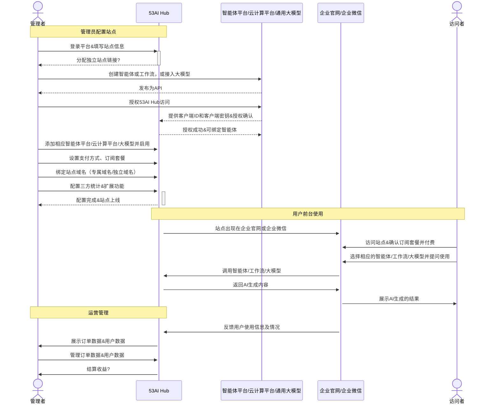

```mermaid
sequenceDiagram
  actor A as 管理者
  participant LoginPage as 53AI Hub #lightblue
  participant P1 as 智能体平台/云计算平台/通用大模型 #lightgreen
  participant P2 as 企业官网/企业微信 #ffcc99
  actor B as 访问者

  %% 管理员配置站点部分 - 蓝色系
  Note over A,LoginPage: 管理员配置站点 #d4f1f9
  A ->>+ LoginPage: 登录平台&填写站点信息 #3399ff
  LoginPage -->>- A: 分配独立站点链接? #3399ff
  A ->> P1: 创建智能体或工作流，或接入大模型 #33cc33
  P1 -->> A: 发布为API #33cc33
  A ->> P1: 授权53AI Hub访问 #33cc33
  P1 -->> LoginPage: 提供客户端ID和客户端密钥&授权确认 #33cc33
  LoginPage -->> P1: 授权成功&可绑定智能体 #33cc33
  A ->>+ LoginPage: 添加相应智能体平台/云计算平台/大模型并启用 #3399ff
  A ->>+ LoginPage: 设置支付方式、订阅套餐 #3399ff
  A ->>+ LoginPage: 绑定站点域名（专属域名/独立域名） #3399ff
  A ->>+ LoginPage: 配置三方统计&扩展功能 #3399ff
  LoginPage -->>- A: 配置完成&站点上线 #3399ff

  %% 站点展示部分 - 橙色系
  Note over LoginPage,B: 用户前台使用 #ffeb99
  LoginPage ->>+ P2: 站点出现在企业官网或企业微信 #ff9933
  %% 前台使用部分 - 绿色系
  B ->> P2: 访问站点&确认订阅套餐并付费 #66cc66
  B ->> P2: 选择相应的智能体/工作流/大模型并提问使用 #66cc66
  P2 ->> LoginPage: 调用智能体/工作流/大模型 #66cc66
  LoginPage ->> P2: 返回AI生成内容 #66cc66
  P2 ->> B: 展示AI生成的结果 #66cc66

  %% 运营管理部分 - 紫色系
  Note over A,LoginPage: 运营管理 #e6ccff
  P2 ->> LoginPage: 反馈用户使用信息及情况 #cc99ff
  LoginPage ->> A: 展示订单数据&用户数据 #cc99ff
  A ->> LoginPage: 管理订单数据&用户数据 #cc99ff
  LoginPage ->> A: 结算收益? #cc99ff
```

