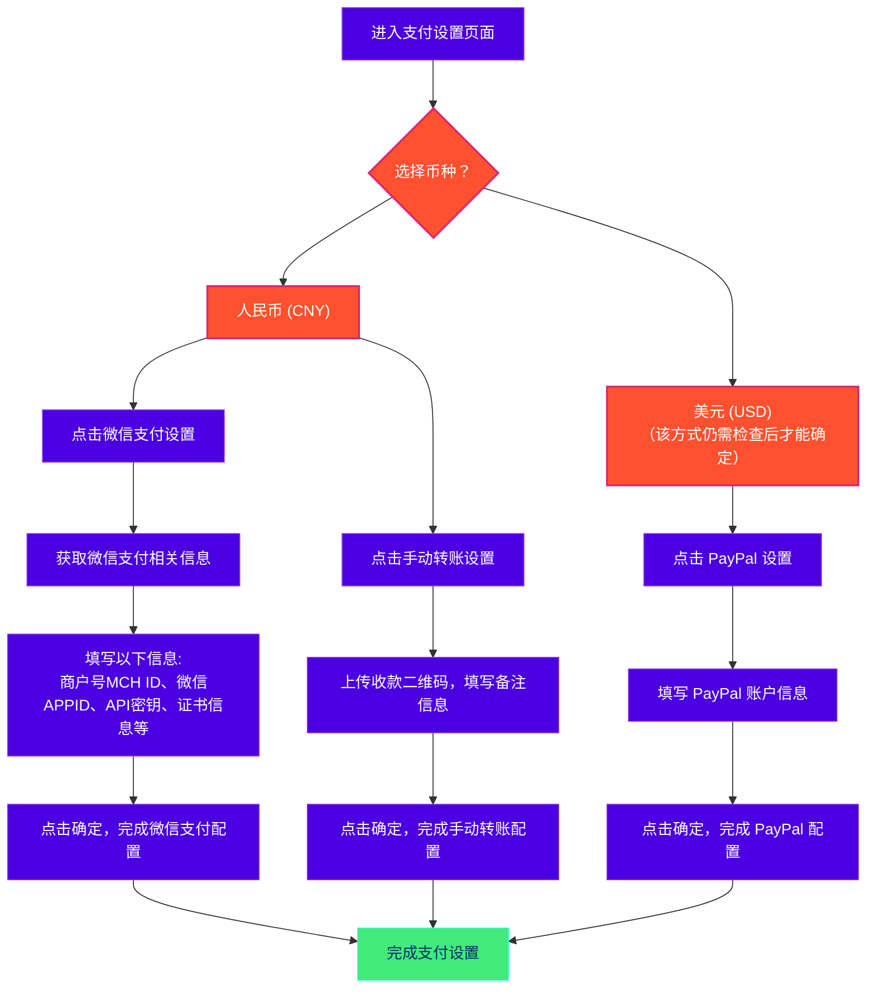

```mermaid
flowchart TD
    Entry["进入支付设置页面"] --> Choice1{"选择币种？"}

    Choice1 --> CNY["人民币 (CNY)"]
    Choice1 --> USD["美元 (USD)<br/>（该方式仍需检查后才能确定）"]

    %% --- CNY 路径 ---
    CNY --> WeChat["点击微信支付设置"]
    WeChat --> GetWeChatInfo["获取微信支付相关信息"]
    GetWeChatInfo --> FillWeChat["填写以下信息:<br/>商户号MCH ID、微信APPID、API密钥、证书信息等"]
    FillWeChat --> SaveWeChat["点击确定，完成微信支付配置"]
    SaveWeChat --> FinalOK["完成支付设置"]

    CNY --> Manual["点击手动转账设置"]
    Manual --> UploadCode["上传收款二维码，填写备注信息"]
    UploadCode --> SaveManual["点击确定，完成手动转账配置"]
    SaveManual --> FinalOK

    %% --- USD 路径 ---
    USD --> PayPal["点击 PayPal 设置"]
    PayPal --> FillPayPal["填写 PayPal 账户信息"]
    FillPayPal --> SavePayPal["点击确定，完成 PayPal 配置"]
    SavePayPal --> FinalOK

    %% 样式定义
    classDef step fill:#4A00E0,stroke:#8E2DE2,color:#ffffff,stroke-width:1px
    classDef decision fill:#FF512F,stroke:#DD2476,color:#ffffff,stroke-width:2px
    classDef final fill:#43E97B,stroke:#38F9D7,color:#003366,stroke-width:1px

    %% 样式应用
    class Entry,WeChat,FillWeChat,GetWeChatInfo,SaveWeChat,Manual,UploadCode,SaveManual,PayPal,FillPayPal,SavePayPal step
    class Choice1,CNY,USD decision
    class FinalOK final
```

