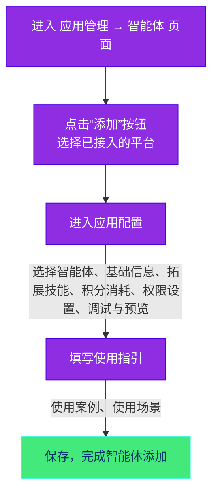

```mermaid
flowchart TD
    Step1["进入 应用管理 → 智能体 页面"] --> Step3["点击“添加”按钮\n选择已接入的平台"]
    Step3 --> Step4["进入应用配置"]
    Step4 -- "选择智能体、基础信息、拓展技能、积分消耗、权限设置、调试与预览" --> Step5["填写使用指引"]
    Step5 -- "使用案例、使用场景" --> Step6["保存，完成智能体添加"]

    Step1:::normalStep
    Step3:::normalStep
    Step4:::normalStep
    Step5:::normalStep
    Step6:::finalStep

    classDef normalStep fill:#8E2DE2,stroke:#4A00E0,stroke-width:1px,color:white
    classDef finalStep fill:#43E97B,stroke:#38F9D7,stroke-width:1px,color:#003366
```

