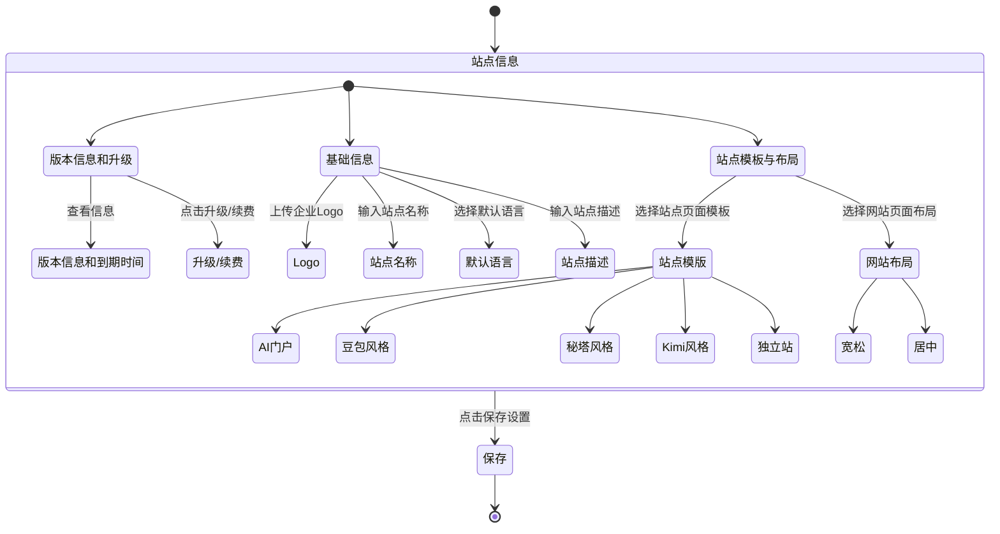

```mermaid
stateDiagram-v2
    [*] --> 站点信息

    state 站点信息 {
        [*] --> 版本信息和升级
        版本信息和升级 --> 版本信息和到期时间 : 查看信息
        版本信息和升级 --> 升级/续费 : 点击升级/续费

        [*] --> 基础信息
        基础信息 --> Logo : 上传企业Logo
        基础信息 --> 站点名称 : 输入站点名称
        基础信息 --> 默认语言 : 选择默认语言
        基础信息 --> 站点描述 : 输入站点描述

        [*] --> 站点模板与布局
        站点模板与布局 --> 站点模版 : 选择站点页面模板
            站点模版 --> AI门户
            站点模版 --> 豆包风格
            站点模版 --> 秘塔风格
            站点模版 --> Kimi风格
            站点模版 --> 独立站
        
        站点模板与布局 --> 网站布局 : 选择网站页面布局
            网站布局 --> 宽松
            网站布局 --> 居中
    }

    站点信息 --> 保存 : 点击保存设置
    保存 --> [*]
```

