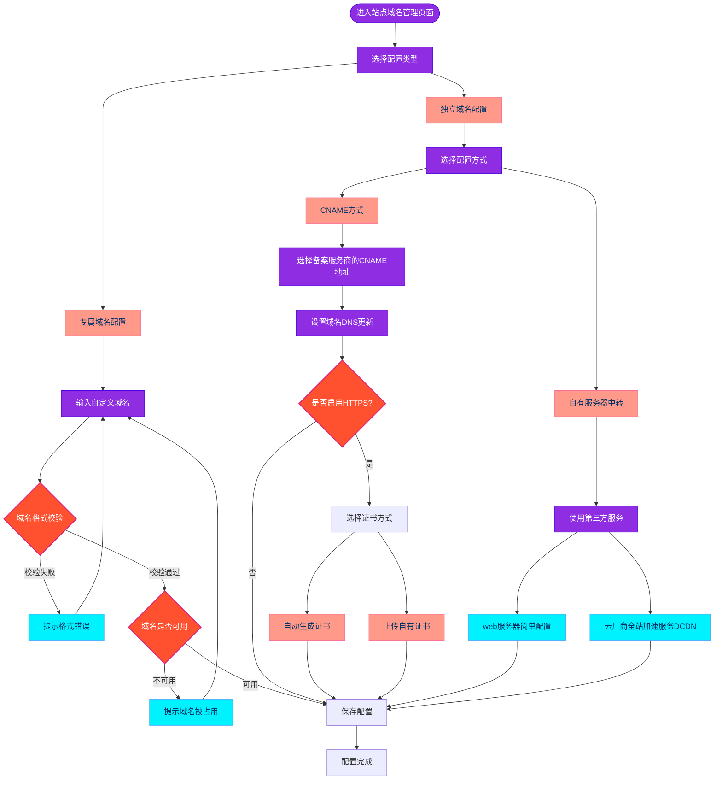

```mermaid
flowchart TD
    A(["进入站点域名管理页面"]) --> B["选择配置类型"]
    B --> C1["专属域名配置"] & C2["独立域名配置"]
    C1 --> D1["输入自定义域名"]
    D1 --> E1{"域名格式校验"}
    E1 -- 校验失败 --> F1["提示格式错误"]
    E1 -- 校验通过 --> G1{"域名是否可用"}
    G1 -- 不可用 --> H1["提示域名被占用"]
    G1 -- 可用 --> S["保存配置"]
    S --> T["配置完成"]
    F1 --> D1
    H1 --> D1
    C2 --> D2["选择配置方式"]
    D2 --> E2["CNAME方式"] & F2["自有服务器中转"]
    E2 --> G2["选择备案服务商的CNAME地址"]
    G2 --> I2["设置域名DNS更新"]
    I2 --> J2{"是否启用HTTPS?"}
    J2 -- 是 --> K2["选择证书方式"]
    J2 -- 否 --> S
    K2 --> M2["自动生成证书"] & N2["上传自有证书"]
    M2 --> S
    N2 --> S
    F2 --> P2["使用第三方服务"]
    P2 --> Q2["web服务器简单配置"] & R2["云厂商全站加速服务DCDN"]
    Q2 --> S
    R2 --> S
     A:::normalStep
     B:::normalStep
     C1:::configStep
     C2:::configStep
     D1:::normalStep
     E1:::decisionStep
     F1:::actionStep
     G1:::decisionStep
     H1:::actionStep
     D2:::normalStep
     E2:::configStep
     F2:::configStep
     G2:::normalStep
     I2:::normalStep
     J2:::decisionStep
     M2:::configStep
     N2:::configStep
     P2:::normalStep
     Q2:::actionStep
     R2:::actionStep
    classDef startEnd fill:#43E97B,stroke:#38F9D7,stroke-width:2px,color:#003366
    classDef normalStep fill:#8E2DE2,stroke:#4A00E0,stroke-width:1px,color:white
    classDef decisionStep fill:#FF512F,stroke:#DD2476,stroke-width:2px,color:white
    classDef actionStep fill:#00F2FE,stroke:#4FACFE,stroke-width:1px,color:#003366
    classDef configStep fill:#FF9A8B,stroke:#FF6B95,stroke-width:1px,color:#003366
    classDef finishStep fill:#4facfe,stroke:#00f2fe,stroke-width:2px,color:white
```

