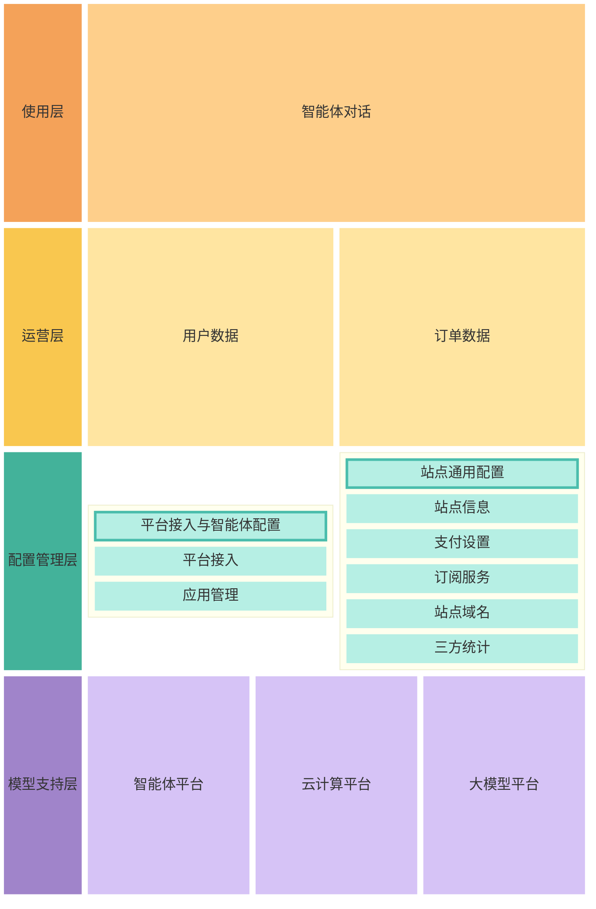

```mermaid
block-beta
  columns 7
  a["使用层"]:1 b["智能体对话"]:6
  c["运营层"]:1 d["用户数据"]:3 e["订单数据"]:3 
  f["配置管理层"]:1
 block:group1:3
   columns 1
   g["平台接入与智能体配置"] h["平台接入"] i["应用管理"]
  end
  block:group2:3
   columns 1
   j["站点通用配置"] k["站点信息"] l["支付设置"] m["订阅服务"] n["站点域名"] o["三方统计"] 
  end

  p["模型支持层"]:1 q["智能体平台"]:2 r["云计算平台"]:2 s["大模型平台"]:2

style a fill:#F4A259,stroke:#F4A259,color:#000,font-weight:bold
style c fill:#F9C74F,stroke:#F9C74F,color:#000,font-weight:bold
style f fill:#43B29A,stroke:#43B29A,color:#fff,font-weight:bold
style p fill:#A084CA,stroke:#A084CA,color:#fff,font-weight:bold

style b fill:#FECF8B,stroke:#FECF8B,color:#000,font-weight:bold,font-size:16px
style d fill:#FFE5A1,stroke:#FFE5A1,color:#000,font-weight:bold,font-size:16px
style e fill:#FFE5A1,stroke:#FFE5A1,color:#000,font-weight:bold,font-size:16px
style g fill:#B6EFE4,stroke:#4ABDAC,color:#000,stroke-width:3px,font-size:16px
style j fill:#B6EFE4,stroke:#4ABDAC,color:#000,stroke-width:3px,font-size:16px
style q fill:#D6C3F6,stroke:#D6C3F6,color:#000,font-weight:bold,font-size:16px
style r fill:#D6C3F6,stroke:#D6C3F6,color:#000,font-weight:bold,font-size:16px
style s fill:#D6C3F6,stroke:#D6C3F6,color:#000,font-weight:bold,font-size:16px

style h fill:#B6EFE4,stroke:#B6EFE4,color:#000
style i fill:#B6EFE4,stroke:#B6EFE4,color:#000
style k fill:#B6EFE4,stroke:#B6EFE4,color:#000
style l fill:#B6EFE4,stroke:#B6EFE4,color:#000
style m fill:#B6EFE4,stroke:#B6EFE4,color:#000
style n fill:#B6EFE4,stroke:#B6EFE4,color:#000
style o fill:#B6EFE4,stroke:#B6EFE4,color:#000
```

