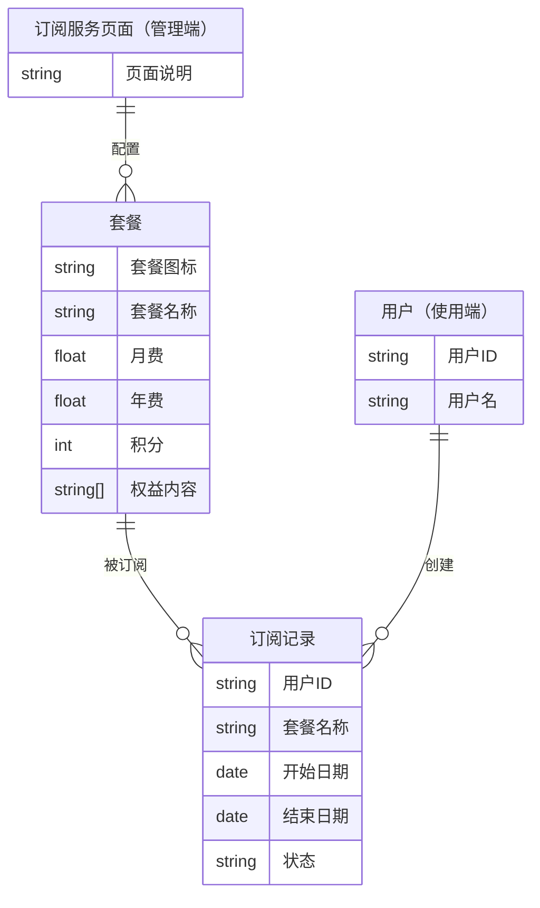

```mermaid
erDiagram
    订阅服务页面（管理端） ||--o{ 套餐 : 配置
    套餐 ||--o{ 订阅记录 : 被订阅
    用户（使用端） ||--o{ 订阅记录 : 创建

    订阅服务页面（管理端） {
        string 页面说明
    }

    套餐 {
        string 套餐图标
        string 套餐名称
        float 月费
        float 年费
        int 积分
        string[] 权益内容
    }

    用户（使用端） {
        string 用户ID
        string 用户名
    }

    订阅记录 {
        string 用户ID
        string 套餐名称
        date 开始日期
        date 结束日期
        string 状态
    }
```

