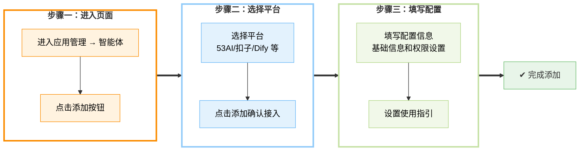

# **智能体**

智能体是一类由大语言模型驱动的智能工具，能够根据提示完成任务拆解、信息分析、内容生成等操作，常用于辅助处理复杂或重复性高的工作。

在「**应用管理 - 智能体**」模块中，您可将预先搭建好的智能体（如“行业洞察”“竞品分析”“SWOT分析”等）一键部署至前台，快速启动 AI 能力。同时，平台支持为每个智能体配置使用权限，您可根据订阅等级或用户角色灵活管控访问范围，确保功能精准触达目标用户。

### **添加智能体**

在“**应用管理 → 智能体**”页面，点击“添加”后，首先从下拉列表中选择已接入的平台：

> 注意：
> 确保目标平台已在 “**站点配置 → 平台接入**”完成授权或 API 配置。

在“**平台**”字段中选择所需模型来源（如 53AI、Dify、FastGPT 等）。
点击“**添加**”进入应用配置与使用指引设置。

我们以扣子为例：

#### **应用配置**

应用配置是将接入的智能体正式投入使用前的关键设置步骤，主要用于补充应用信息、配置权限范围、启用拓展功能，并支持调试与预览效果，确保智能体以合适的身份、方式和范围出现在前端。

* **选择智能体**:设置相应工作空间与智能体。
* **基础信息**:创建应用时，你需要给应用起一个名字、选择合适的图标，或者上传喜爱的图片用作图标、设置分组、使用一段清晰的文字描述此应用的用途，以便后续应用在团队内的使用。
* **拓展技能**：是否开启联网搜索。
* **积分消耗**：设置相应积分消耗。
* **权限设置**:在配置智能体时，需要选择该智能体的**使用权限**。根据选择，智能体的使用权限将仅限于对应订阅等级的用户以及对应分组的内部用户。
* **调试与预览**：在编排完助手之后，你可以在发布成应用之前进行调试与预览，查看助手的任务完成效果。

#### **使用指引**

使用指引模块旨在通过 `“使用案例”`与 `“使用场景”`两个部分，帮助前台用户快速理解智能体的使用方式与应用范围。在前台使用智能体时，用户可通过侧边栏入口随时查看该部分内容，提升上手效率与使用体验。

* **使用案例**
  点击 `“添加”`按钮，设置 `输入`与 `输出`，创建使用案例，帮助用户更直观地了解智能体的操作流程，提升使用体验。

* **使用场景**
  点击 `“添加”`按钮，上传示图并设置场景描述，为应用添加更多实际使用场景，便于用户快速理解应用的适用范围。

### **分组管理**

在「**智能体**」页面，点击右上角的**分组**按钮，即可进入分组管理界面。您可以在此创建多个分组并通过拖拽调整显示顺序，为后续的智能体配置提供清晰分类。配置应用时，仅能选择已有分组，建议提前设置好对应分组，以提升整体管理效率与使用体验。

* **新增分组**
  点击 **+ 添加**，在弹出的文本框中输入分组名称（不超过10个字符），按下回车或点击确认完成创建。
* **命名或重命名**
  单击已有分组名称，直接编辑文本框内容，按回车保存。
* **顺序调整**
  将鼠标悬停在分组左侧的拖拽手柄上，按住并拖动即可调整分组显示顺序。

### **常见问题**

xxxxxx

