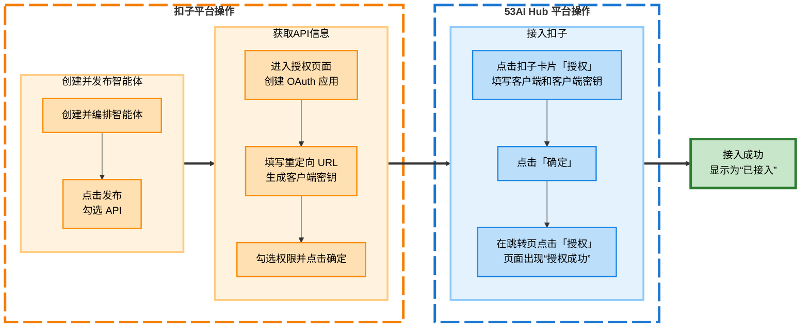
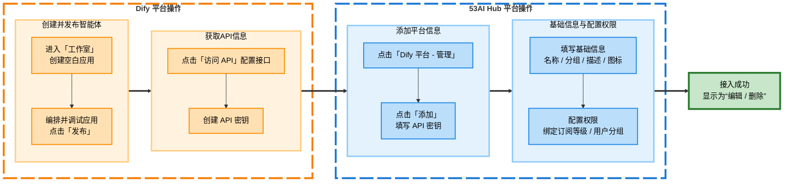
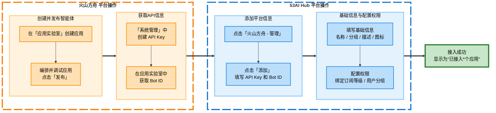
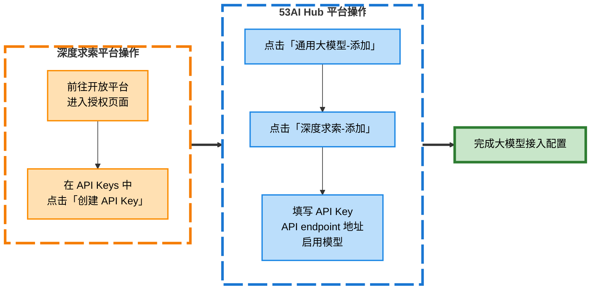

# 平台接入

**平台接入**是配置53AI Hub站点的关键步骤之一。你可以通过**平台接入**将各个智能体开发平台、云计算平台和大模型平台接入到 53AI Hub，实现智能体的统一发布和运营。你可以根据业务需求和实际情况，选择需要接入的平台。

> 53AI Hub 产品定位是智能体（AI Agent）的**发布与运营平台**存在，平台本身不提供智能体开发及编排能力。你需要将外部平台中开发好的智能体接入到 53AI Hub。

## 支持的平台

### 1. 智能体平台

支持市场上主流的智能体开发平台开发的智能体统一接入53AI Hub，进行统一发布和运营。

> 已支持平台包括：扣子、千帆 AppBuilder、Dify、53AI Studio、腾讯元器、FastGPT

### 2. 云计算平台

支持主流的云计算平台上开发的智能体统一接入到 53AI Hub，进行统一发布和运营。

> 已支持平台包括：阿里百炼、火山方舟、百度千帆 AppBuild

### 3. 大模型平台

支持主流大模型平台的基座模型能力直接接入到53AI Hub，为用户直接提供基座模型能力。

> 已支持平台包括：OpenAI、硅基流动、深度求索及其它兼容 OpenAI 接口的大模型平台

## **开始接入**

点击**站点配置-平台接入**

### **智能体平台**


#### 其中**扣子、千帆AppBuilder**支持将平台开发的全部智能体进行统一授权

以下是**扣子**的平台授权及智能体添加的流程图：



**在扣子中的操作**

**· 智能体创建与发布**

- 在扣子平台创建并编排所需的智能体
- 点击「**发布**」按钮
- 在「**选择发布平台 - API**」区域，**勾选 API** 权限


**· 信息获取**

- 前往 [**扣子开放平台授权页面**](https://www.coze.cn/open/oauth/apps)
- 创建一个 OAuth 应用，客户端类型选择「**Web 后端应用**」
- 在“**重定向 URL**”栏粘贴地址：
  `https://hubapi.53ai.com/api/callback/cozecn/auth/**`
  （可在平台接入 > 授权扣子 > 弹窗操作指引中直接复制）
- 点击「**生成客户端密钥**」
- 勾选所需权限并点击「**确定**」完成设置


**在 53AI Hub 中的操作**

- 点击平台接入中的扣子卡片的「**授权**」
- 将扣子中获取的 **客户端 ID** 和 **客户端密钥** 填入对应表单
- 点击「**确定**」，并在跳转页点击「**授权**」
- 页面出现“**授权成功**”提示后返回 Hub，若扣子图标下方显示为「编辑 / 删除」，表示接入成功


---

#### **53AI、Dify(逐一添加）**

我们以**Dify**为例：



**在 Dify 中的操作**

- 进入「**工作室**」页面，点击「**创建空白应用**」
- 编排智能体，完成调试预览后点击「**发布**」


- 点击「**访问 API**」进入接口配置页面
- 右上角点击「**API 密钥**」>「**创建密钥**」获取授权信息


**在 53AI Hub 中的操作**

**· 添加平台信息**

- 前往平台接入页，点击「**Dify 平台 - 管理**」
- 点击「**添加**」，将 `API 密钥` 填入表单
- 点击「**保存**」完成平台信息配置


**· 填写基础信息**

- 接入成功后，需补充该智能体的基础信息，包括名称、分组、描述与头像
- 基础信息将展示在前台，建议命名简洁明确，便于使用者识别功能

**· 权限设置**

- 设置智能体的访问权限
- 可根据订阅等级或用户分组配置使用范围，实现权限精细化管理
  

### **云计算平台**


#### 阿里百炼、火山方舟（逐一添加）

我们以**火山方舟**为例：



**在火山方舟中的操作**

- 在火山引擎中搭建所需的智能体
- 进入「**系统管理 - API Key 管理**」，点击「**创建 API Key**」获取密钥
- 前往「**应用实验室 - 我的应用**」，在对应应用下方可查看并复制 `Bot ID`


**在 53AI Hub 中的操作**

**· 添加平台信息**

- 前往平台接入页，点击「**火山方舟 - 管理**」
- 点击「**添加**」，将 `API Key` 和 `Bot ID` 填入表单
- 点击「**保存**」完成平台信息配置


**· 填写基础信息**

- 接入成功后，需补充该智能体的基础信息，包括名称、分组、描述与头像
- 基础信息将展示在前台，建议命名简洁明确，便于使用者识别功能

**· 权限设置**

- 设置智能体的访问权限
- 可根据订阅等级或用户分组配置使用范围，实现权限精细化管理


### **通用大模型**


我们以**深度求索**为例：



**在深度求索中的操作**

- 前往深度求索开放平台授权页面
- 在「**API Keys**」栏目点击「**创建 API Key**」获取密钥


**在 53AI Hub 中的操作**

**· 添加平台信息**

- 前往平台接入页，点击「**添加**」
- 在「**选择模型接入**」中选择「**深度求索**」
- 输入 `API Key`
- 选择要启用的模型
- 点击「**保存**」完成大模型接入配置


## **使用模型**

配置完模型后，就可以在应用中使用这些模型了


## **常见问题**

xxxxxx

```

```

